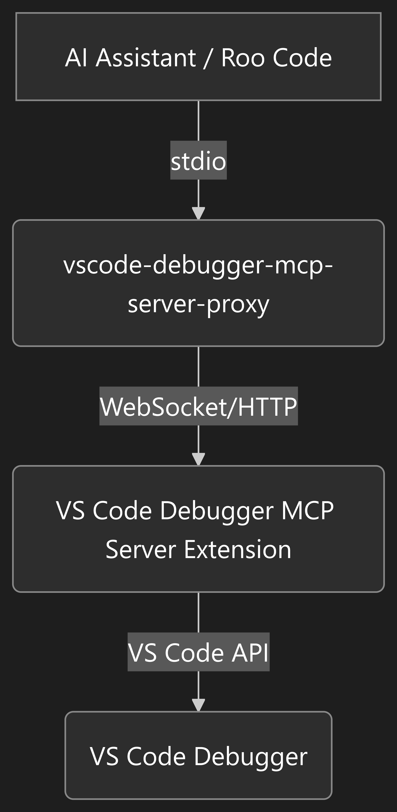

# VS Code Debugger MCP Server Proxy

This proxy acts as a bridge, enabling AI assistants that communicate via `stdio` to connect to the **VS Code Debugger MCP Server**, which uses `HTTP` or `SSE`.

---

## Why Use This Proxy?

This tool is essential if your AI assistant, such as Roo Code, does not support direct `HTTP` or `SSE` connections and requires a `stdio`-based server to interact with the VS Code debugger. It translates the `stdio` communication from your AI tool into a format the main debugger extension can understand.

---


## Supercharge Your AI with the Main Extension

This proxy is a companion to the **VS Code Debugger MCP Server** extension. The main extension is what gives your AI its debugging superpowers.

[**Install it from the VS Code Marketplace**](https://marketplace.visualstudio.com/items?itemName=rauschit.vscode-debugger-mcp-server)

---

## Prerequisites

Before you begin, ensure you have the following installed:

1.  **Node.js and npm:** [Download and install Node.js](https://nodejs.org/).
2.  **VS Code Debugger MCP Server:** Install the main extension from the [VS Code Marketplace](https://marketplace.visualstudio.com/items?itemName=rauschit.vscode-debugger-mcp-server).

---

## Important: Extension Settings

**To use this proxy, you must set the transport type of the VS Code Debugger MCP Server extension to "websocket" in the extension's settings in VS Code.**

1. Open VS Code.
2. Go to **Settings** (`Ctrl+,`).
3. Search for **VSCode Debugger MCP Server**.
4. Set the **Transport Type** to `websocket`.

---

## Installation and Build

Follow these steps to get the proxy up and running:

1.  **Clone the repository:**
    ```bash
    git clone https://github.com/your-username/vscode-debugger-mcp-server-proxy.git
    cd vscode-debugger-mcp-server-proxy
    ```

2.  **Install dependencies:**
    ```bash
    npm install
    ```

3.  **Build the project:**
    ```bash
    npm run build
    ```
    This will compile the TypeScript source code into JavaScript in the `dist` directory.

---

## Configuration

To connect your AI assistant, you need to configure it to use this proxy. Here is an example configuration for Roo Code:

### Stdio MCP Server Config for Roo Code

Add the following to your Roo Code settings:

```json
{
  "mcpServers": {
    "vscode-debugger": {
      "command": "node",
      "args": [
        "d:/Projekte/MCP/vscode-debugger-mcp-server-proxy/dist/index.js", 
        "-p",  
        "10101"
      ],
      "env": {
        "DEBUG": "false"
      },
      "disabled": false,
      "type": "stdio"
    }
  }
}
```

**Important:** Make sure the path in the `args` array is the absolute path to the compiled `index.js` file on your system.

**Note:** The port number (`10101` in the example above) must match the port configured and **Transport Type** is set to `websocket` in the VS Code Debugger MCP Server extension settings. Ensure both the proxy and the extension are set to use the same port for successful communication.

---

## How It Works

The proxy sits between your AI assistant and the main debugger extension, translating communication between them.

<p align="center">
  
</p>

---


## License

This project is open source and licensed under the [MIT License](./LICENSE).